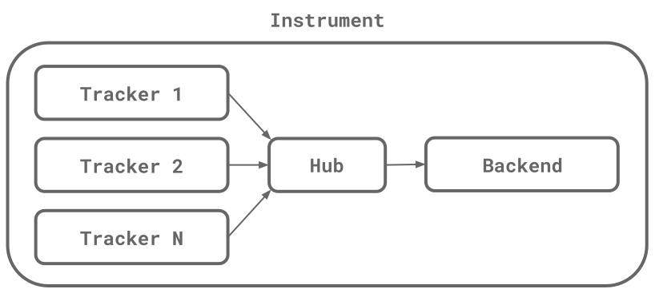

# OpenAVT-iOS

[](https://github.com/asllop/OpenAVT-iOS)
[](https://github.com/asllop/OpenAVT-iOS)

1. [ Introduction ](#intro)
2. [ Installation ](#install)
3. [ Behaviour ](#behav)
4. [ Examples ](#examp)
5. [ Documentation ](#doc)
6. [ Author ](#auth)
7. [ License ](#lice)

<a name="intro"></a>
## 1. Introduction

The Open Audio-Video Telemetry is a set of tools for performance monitoring in multimedia applications. The objectives are similar to those of the OpenTelemetry project, but specifically for sensing data from audio and video players.

<a name="install"></a>
## 2. Installation

To install OpenAVT-iOS, simply add the following line to your Podfile:

```ruby
pod 'OpenAVT-Core', :git => 'https://github.com/asllop/OpenAVT-iOS'
```

The `OpenAVT-Core` is the base package, needed by all the rest. But you also need to add pods for the specific OpenAVT components you will use in your project.

The following packages are available:

#### AVPlayer Tracker

```ruby
pod 'OpenAVT-AVPlayer', :git => 'https://github.com/asllop/OpenAVT-iOS'
```

#### Google IMA Tracker

```ruby
pod 'OpenAVT-IMA', :git => 'https://github.com/asllop/OpenAVT-iOS'
```

<a name="behav"></a>
## 3. Behaviour

#### The Instrument

In OpenAVT the central concept is the **Instrument**, implemented in the class `OAVTInstrument`. An instrument contains a chain of objects that captures, processes and transmits data from a multimedia player. Each of these three steps is represented by:

- **Trackers**: classes conforming to `OAVTTrackerProtocol`, used to captured data from a specific player.

- **Hubs**: classes conforming to `OAVTHubProtocol`, used to process the data captured by a tracker. A hub also keeps a state, an instance of `OAVTState`.

- **Backends**: classes conforming to `OAVTBackendProtocol`, used to transmit data processed by a hub.

These objects represent a chain because the data captured by a tracker is sent to a hub that processes it and passes it to the backend.

One instrument can contain multiple trackers, but only one hub and one backend.



An instrument is defined like this:

```swift
let instrument = OAVTInstrument(hub: AnyHub(), backend: AnyBackend())
let tracker1Id = instrument.addTracker(AnyTracker1())
let tracker2Id = instrument.addTracker(AnyTracker2())
let trackerNId = instrument.addTracker(AnyTrackerN())
instrument.ready()
```

#### The Data

We talked about data being captured and passed along the instrument chain, but what is the nature of this data?

In OpenAVT the data unit is the **Event**, implemented in the class `OAVTEvent`. An event contains an **Action** (class `OAVTAction`) and a list of **Attributes** (class `OAVTAttribute`).

The action tells us what is the event about, for example when a video starts, an event with the action `OAVTAction.START` is sent.

The attributes offers context for the actions. For example, the attribute `OAVTAttribute.DURATION` informs the stream duration in milliseconds.

#### The Chain

The instrument chain describes the steps followed by an event from the moment it is created till the end of the chain.

1. The jorney of an event starts with a call to `OAVTInstrument.emit(...)`. This function takes an action and a tracker, and generates en event. Initially the event only contains few attributes: the sender ID (that identifies a tracker within an instrument), the time since attributes of previous events and the custom attributes of the instrument created with `OAVTInstrument.addAttribute(...)`.
2. Once the event is created it is sent to the tracker, calling the method `OAVTTrackerProtocol.initEvent(...)`. This method receives an event and returns it, in between it can be tranformed by adding/changing attributes (calling `OAVTEvent.setAttribute(...)`), or even it can stop the chain by returning a nil.
3. The event passed by the tracker is sent to the hub, calling `OAVTHubProtocol.processEvent(...)`. This method works like the previous, it can change the event or block it.
4. Once the hub have processed the event, it is sent to the backend calling `OAVTBackendProtocol.receiveEvent(...)`. Again, the event can be modified or blocked.
5. Optionally, the user can define an interceptor. That is a code block that is executed right after receiveEvent. An interceptor receives an event and can tranform it as usual, but it can't block it. It must return an event, not nil. An interceptor can be defined by calling `OAVTInstrument.setIntercept(...)`.
6. Finally the event is passed to `OAVTBackendProtocol.sendEvent(...)`, that is the last step.

<a name="examp"></a>
## 4. Examples

Inside the `Examples` folder you will find multiple usage examples. To run them execute `pod install` from each example directory.

#### ExampleAVPlayer

Shows how to use the AVPlayer tracker.

#### ExampleAVPlayer+IMA

Shows how to use the AVPlayer tracker and the Google IMA ads tracker.

<a name="doc"></a>
## 5. Documentation

TODO: create autodocs and tutorials.

<a name="auth"></a>
## 6. Author

Andreu Santarén Llop<br>
<andreu.santaren@gmail.com>

<a name="lice"></a>
## 7. License

OpenAVT-iOS is available under the MIT license. See the LICENSE file for more info.
